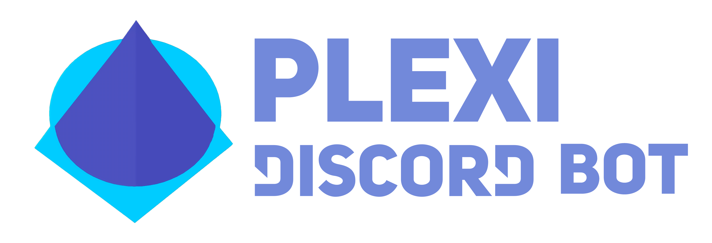

<div align="center">
  <br />
  <p>
    <a href="https://nigecat.github.io/Plexi/invite"></a>
  </p>
  <br />
  <p>
    <a href="https://github.com/Nigecat/Plexi"></a>
    <a href="https://david-dm.org/Nigecat/Plexi"></a>
    <a href="https://nigecat.github.io/Plexi/support"></a>
  </p>
</div>

A general purpose discord bot

## Setup

Development dependencies can be installed by running `npm ci --no-optional`.
For a production environment it is recommended to install all dependencies, this can be done with `npm ci`.

The bot pulls it's tokens from environment variables. There are five fields it checks for:

- `DISCORD_TOKEN` - the [bot token](https://discord.com/developers/applications).
- `YOUTUBE_TOKEN` - a [youtube data api v3 token](https://console.developers.google.com/apis/credentials).
- `TOPGG_TOKEN` - the [top.gg token](https://top.gg/api/docs#mybots).
- `DATABASE_URI` - a uri to a [mongodb](https://www.mongodb.com/) database to store persistent data in, must begin with `mongodb://` (this is highly recommended even for development).
- And finally if `NODE_ENV` is set to `production` the console.logs will be disabled and written to the logs/ directory.

The only required token is the discord token. Everything else is technically optional (though, if a command is run that requires one a token that was not specified it will cause an error).
The top.gg token will only be used if we are in production mode.

The environment variables can also be automatically loaded from a `.env` file placed in the root directory of this project.
A minimal setup would look like:

```markdown
DISCORD_TOKEN=xxxxxxxxxxx
```

The bot can then be started with `npm start`.


## Contributing

In a developement environment it is recommended to change the owner id in [index.ts](index.ts) to your id, this allows you to access the debug commands like shutdown and reload.  
(NOTE: Reload will refresh all commands but WILL NOT recompile any of them, this must be done manually prior with `npm run build` or using watch mode with `npm run build:watch`)

### Creating a command

Each command is stored in `src/commands/commands/<group>/<commandName>.ts`. The first step is to create a file there.   
The file name should match the command name and they should both be all lowercase.  
Each command must default export a class inheriting from the command class defined in [Command.ts](src/commands/Command.ts).  
The name of the class should be PascalCase. For example, if we had a command called banuser, the class would be named BanUser.  
Any specified arguments are automatically converted to the required type and passed as an array to the run function.  
It is recommended to look at existing commands to get an idea of what it looks like, here is an example [avatar](src/commands/commands/General/avatar.ts) command:
```javascript
import { Plexi } from "../../../Plexi";
import { Command } from "../../Command";
import { Message, User, MessageEmbed } from "discord.js";

export default class Avatar extends Command {
    constructor(client: Plexi) {
        super(client, {
            name: "avatar",
            group: "General",
            description: "Get a user's avatar",
            args: [{ name: "user", type: "user" }],
        });
    }

    run(message: Message, [user]: [User]): void {
        const embed = new MessageEmbed({
            color: "#0099ff",
            title: user.tag,
            image: { url: user.avatarURL({ dynamic: true, format: "png", size: 512 }) },
        });
        message.channel.send({ embed });
    }
}
```
The available command options can be seen in the CommandInfo interface exported from [Command.ts](src/commands/Command.ts).

### What if the thing I want to add would involve touching multiple files or the main client?
You might want to create a plugin. They are stored in the [plugins](src/plugins/) directory, each one default exports a function that gets called with the client object after the bot finishes initializing.  
They can then do their own thing like registering additional on message event handlers.
